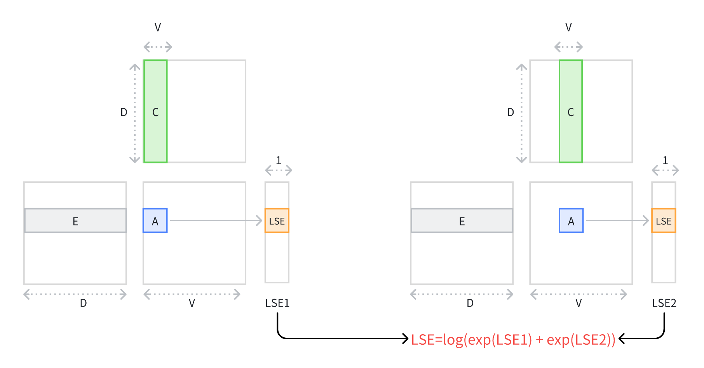

# ✂️Cut-Cross-Entropy-Pytorch

It’s Pytorch-version Cut-Cross-Entropy([CCE](!https://arxiv.org/abs/2411.09009)) implementation: 

1. GEMM
2. LSE-style CCE Forward
3. LSE CCE Backward
4. Linear-Cross-Entropy backward

Here is a blog for explaination of CCE: [zhihu](https://zhuanlan.zhihu.com/p/13548439339)

### Reference

 [Cut Your Losses in Large-Vocabulary Language Models](https://arxiv.org/abs/2411.09009)